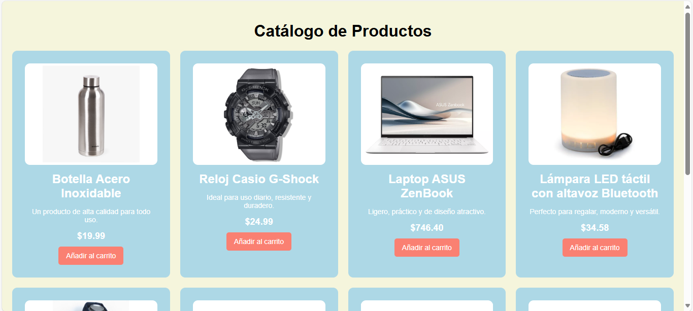
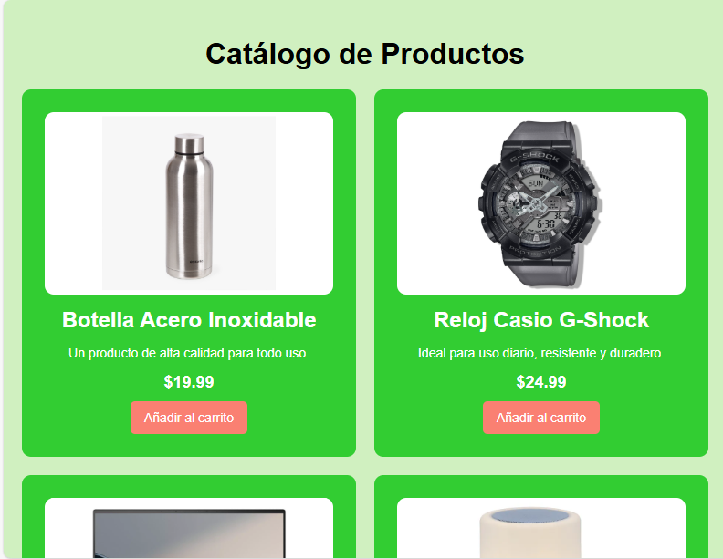
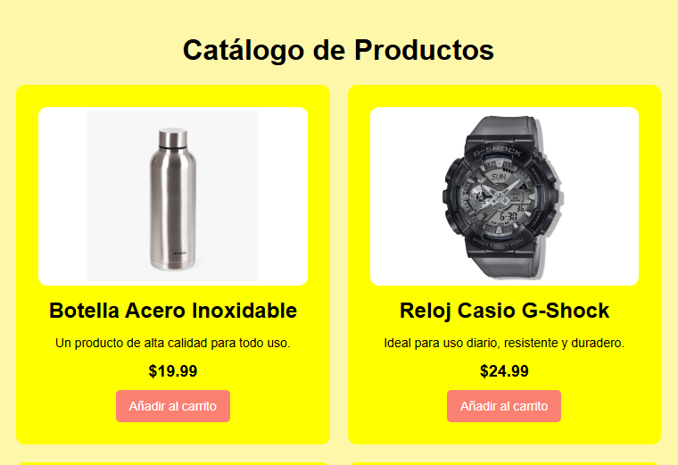
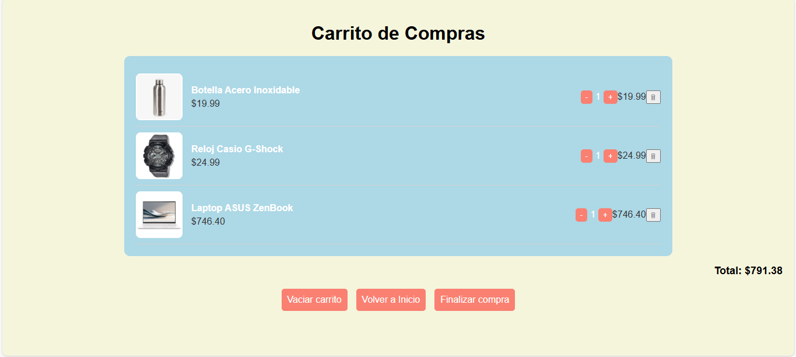
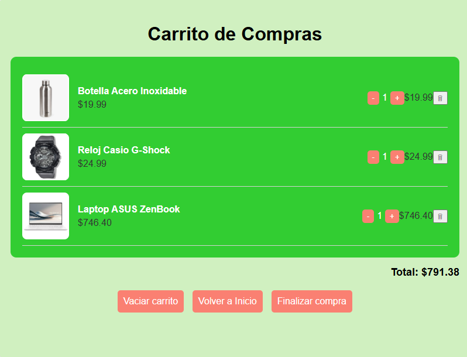
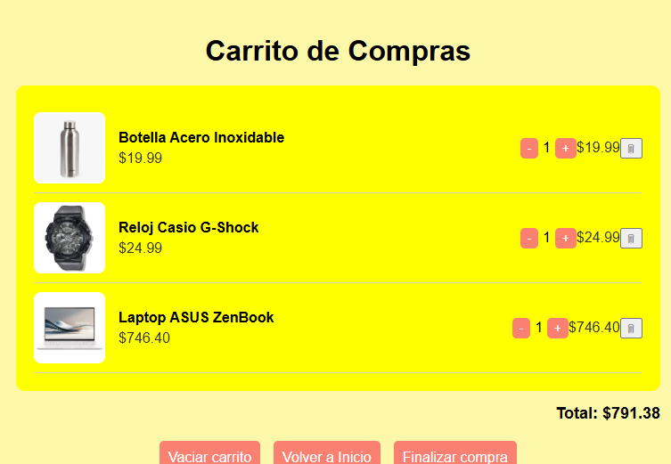

# Tienda Web con Carrito de Compras

Una tienda web interactiva creada con **HTML, CSS y JavaScript**, que permite explorar productos y agregarlos a un carrito de compras de manera dinámica.

## Características

- Catálogo de productos con imágenes, nombre, descripción y precio.
- Botón para añadir productos al carrito con **feedback visual temporal**.
- Carrito persistente usando **localStorage**.
- Modificación de cantidades y eliminación de productos en la página del carrito.
- Cálculo automático del total de la compra.
- Botones para vaciar el carrito, volver al catálogo o finalizar la compra.
- Diseño **responsivo**, compatible con computadoras, tablets y móviles.

## Estructura del proyecto

```
/css
    styles.css       # Estilos del catálogo
    carrito.css      # Estilos del carrito
/html
    index.html       # Catálogo de productos
    carrito.html     # Página del carrito
/js
    script.js        # Funcionalidad del catálogo
    carrito.js       # Funcionalidad del carrito
```

## Uso

1. Abrir `index.html` en el navegador.
2. Añadir productos al carrito y hacer clic en **Ver carrito**.
3. Modificar cantidades, eliminar productos o finalizar la compra.

# Ejemplos de Uso (Página Principal)





# Ejemplos de Uso (Carrito)






